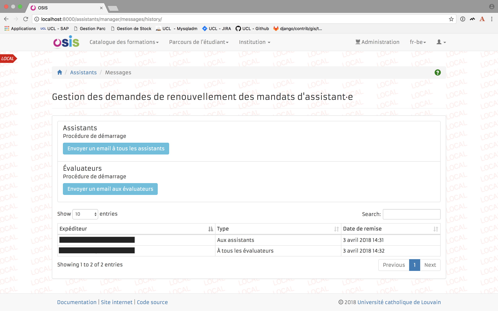
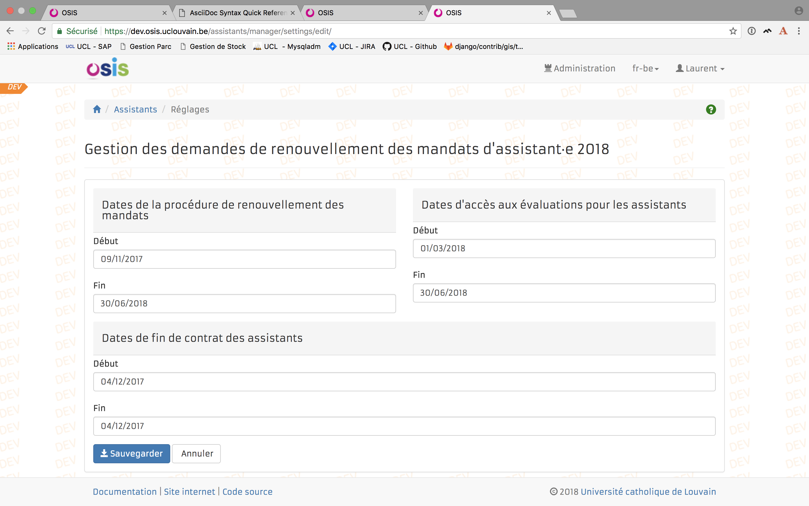

:icons: font
:sectnums:
:lang: fr

== Fonctionnalités

=== Les administrateurs

==== Importation des données

En début de procédure, un administrateur de l'application importe les données depuis un **fichier XLSX**.
Ce fichier doit contenir **23 colonnes**. Chaque colonne doit avoir **un titre précis**.

.Titres des colonnes et données
|===
|Titre|Exemple de donnée
|SECTOR|SST
|LOGISTICS_ENTITY|ASS
|FACULTY|SC
|SCHOOL|CHIM
|INSTITUTE|IMCN
|POLE|MOST
|SAP_ID|1122199
|GLOBAL_ID|1122199
|LAST_NAME|Nom
|FIRST_NAME|Prénom
|FULLTIME_EQUIVALENT|1
|ENTRY_DATE|01/02/2015
|END_DATE|03-10-2017
|ASSISTANT_TYPE_CODE|ST ou AS
|SCALE|021
|CONTRACT_DURATION|4
|CONTRACT_DURATION_FTE|4
|RENEWAL_TYPE|NORMAL ou EXCEPTIONAL
|ABSENCES|Des absences
|COMMENT|Un commentaire
|OTHER_STATUS|AH, CH ou PX
|EMAIL|prenom.nom@uclouvain.be
|FGS|201968
|===

IMPORTANT: Si les données ont déjà été importées une première fois, les mandats d'assistant existants dans
l'application ne sont pas supprimés mais mis à jour. Si une des entités (secteur, entité logistique, faculté, école,
institut ou pôle) est modifiée dans le fichier XLSX, la précédente entité du même type pour le mandat considéré est
remplacée par la nouvelle .

==== Gestion des emails

Des emails sont envoyés à différentes étapes durant la procédure. Certains sont envoyés automatiquement et d'autres par une
action d'un administrateur.

TIP: Dans les exemples donnés pour les templates, #{{ nom_de_variable }}# représente une variable dont le contenu sera affiché dans
l'email envoyé.

===== Emails envoyés automatiquement

* Lorsqu'un assistant valide sa demande de renouvellement et a encodé un promoteur de thèse, un email est envoyé à
celui-ci (voir <<template-supervisor>>).
* Lorsqu'un assistant décline sa demande de renouvellement et que son mandat est lié à une faculté, le doyen de cette
faculté reçoit un email pour le notifier de ce refus (voir <<template-dean>>).
* Lorsque un administrateur ajoute ou remplace un évaluateur, un email est envoyé à celui-ci (voir <<template-reviewer>>).
* Lorsqu'un évaluateur délègue son rôle pour une entité à une personne (qui devient ainsi aussi un évaluateur), cette
dernière reçoit un email (voir <<template-reviewer>>).

[[template-supervisor]]
.Template de l'email envoyé au promoteur de thèse
==========================
Ceci est un message automatique généré par le serveur OSIS – Merci de ne pas y répondre.

La procédure de renouvellement des mandats des assistant·e·s dont le contrat arrive à échéance entre le #{{ start_date }}#
et le #{{ end_date }}# vient de débuter. Elle s'effectue intégralement par voie électronique.

Vous recevez ce message en tant que superviseur de thèse pour #{{ assistant }}#.

Pour accéder à la procédure et compléter votre avis, il vous suffit de suivre le lien
suivant: https://osis.uclouvain.be/assistants/phd_supervisor/assistants

Cordialement,

Service du Personnel

Contact : Marie-Dominique Heureux
==========================

[[template-dean]]
.Template de l'email envoyé aux doyen de faculté si l'assistant décline
==========================
Ceci est un message automatique généré par le serveur OSIS – Merci de ne pas y répondre.

La procédure de renouvellement des mandats des assistant·e·s dont le contrat arrive à échéance entre le #{{ start_date }}# 
et le #{{ end_date }}# vient de débuter. Elle s'effectue intégralement par voie électronique.

Vous recevez ce message car #{{ assistant }}# a décliné sa demande de renouvellement.

Cordialement,

Service du Personnel

Contact : Marie-Dominique Heureux
==========================

[[template-reviewer]]
.Template de l'email envoyé aux évaluateurs
==========================
Ceci est un message automatique généré par le serveur OSIS – Merci de ne pas y répondre.

Nous venons de lancer la procédure de renouvellement des mandats des assistant·e·s dont le contrat arrive à échéance
entre le #{{ start_date }}# et le #{{ end_date }}#.
Nous attirons votre attention sur le fait que les assistant·e·s ayant une échéance au #{{ end_date }}# n'ont pas été
intégrés à la procédure.
Elle s'effectue intégralement par voie électronique.

Pour accéder à la procédure, il vous suffit de suivre le lien suivant: https://osis.uclouvain.be/assistants

Pour rappel, toute demande de renouvellement introduite par un·e assistant·e doit être mise dans le circuit et ne peut être bloquée sous prétexte que les avis sont négatifs car l'assistant·e a, dans ce cas, le droit d'introduire un recours selon l'article 50 du RAMCS.

Cordialement,

Service du Personnel

Contact : Marie-Dominique Heureux
==========================

===== Emails envoyés par une action d'un administrateur

Un administrateur peut déclencher deux envois d'emails. Un tableau montre l'historique d'envoi des courriels (voir <<messages_managers>>) :

1. Envoyer un email à tous les assistants en début de procédure. Il y a un template pour les renouvellements normaux
(voir <<template-startup-assistant-normal>>) et un pour les renouvellements exceptionnels (voir <<template-startup-assistant-exceptionnel>>).

2. Envoyer un email à *tous* les évaluateurs en début de procédure (voir <<template-startup-reviewers>>).

[[messages_managers]]
.Envoi des emails en début de procédure

[[template-startup-reviewers]]
.Template de l'email envoyé aux évaluateurs en début de procédure
==========================
Ceci est un message automatique généré par le serveur OSIS – Merci de ne pas y répondre.

Nous venons de lancer la procédure de renouvellement des mandats des assistant·e·s dont le contrat arrive à échéance
entre le #{{ start_date }}# et le #{{ end_date }}#.
Nous attirons votre attention sur le fait que les assistant·e·s ayant une échéance au #{{ end_date }}# n'ont pas été
intégrés à la procédure.
Elle s'effectue intégralement par voie électronique.

Pour accéder à la procédure, il vous suffit de suivre le lien suivant: https://osis.uclouvain.be/assistants

Pour rappel, toute demande de renouvellement introduite par un·e assistant·e doit être mise dans le circuit et ne
peut être bloquée sous prétexte que les avis sont négatifs car l'assistant·e a, dans ce cas, le droit d'introduire
un recours selon l'article 50 du RAMCS.

Cordialement,

Service du Personnel

Contact : Marie-Dominique Heureux
==========================

[[template-startup-assistant-normal]]
.Template de l'email envoyé aux assistants en début de procédure pour un renouvellement normal
==========================
Bonjour #{{ first_name}}# #{{ last_name}}#,

Ceci est un message automatique généré par le serveur OSIS – Merci de ne pas y répondre.

La procédure de renouvellement des mandats des assistant·e·s dont le contrat arrive à échéance entre le #{{ start_date }}# 
et le #{{ end_date }}# vient de débuter. Elle s’effectue intégralement par voie électronique.

Pour accéder à la procédure, il vous suffit de suivre le lien suivant: https://osis.uclouvain.be​​​​​​​/assistants

Cordialement,

Service du Personnel

Contact : Marie-Dominique Heureux
==========================

[[template-startup-assistant-exceptionnel]]
.Template de l'email envoyé aux assistants en début de procédure pour un renouvellement exceptionnel
==========================
Bonjour #{{ first_name}}# #{{ last_name}}#,

Ceci est un message automatique généré par le serveur OSIS – Merci de ne pas y répondre.

La procédure de renouvellement des mandats des assistant·e·s dont le contrat arrive à échéance entre le #{{ start_date }}# 
et le #{{ end_date }}# vient de débuter. Elle s’effectue intégralement par voie électronique.

Dans votre cas, vous avez atteint le nombre maximum d'années de mandat autorisées pour demander un renouvellement normal,
donc si vous le souhaitez et si vous avez des circonstances exceptionnelles qui le justifient,
vous pouvez introduire une demande de renouvellement exceptionnel d'un an. Pour cela, nous vous demandons d'apporter
une argumentation approfondie pour faciliter la décision des autorités sur le caractère exceptionnel ou non de ces circonstances.

Pour accéder à la procédure, il vous suffit de suivre le lien suivant: https://osis.uclouvain.be​​​​​​​/assistants

Cordialement,

Service du Personnel

Contact : Marie-Dominique Heureux
==========================

==== Les réglages

Ils sont accessibles uniquement aux administrateurs. *Trois intervalles de dates* en font partie (voir <<settings_managers>>) :

1. _Les dates de la procédure de renouvellement des mandats_. C'est à cet endroit qu'on définit quand les *évaluateurs*
et les *assistants* peuvent se connecter dans l'application.

2. _Les dates d'accès aux évaluations pour les assistants_. Ce réglage permet de définir quand les assistants peuvent
avoir un accès aux avis donnés par les évaluateurs.

3. _Les dates de fin de contrat des assistants_. Ces dates sont utilisées dans les templates des emails (variables
{{ start_date }} et {{ end_date }}).

IMPORTANT: *Le réglage 2 ne sert à rien si l'intervalle de dates n'est pas inclus dans l'intervalle du réglage 1.*

[[settings_managers]]
.Réglages

